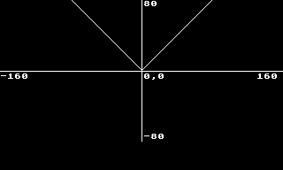

# Turbo-BASIC XL cheatsheet


## Turbo-BASIC XL keywords

```
+----------+----------+---+----------------------------------------------------------------+
| Keyword  |  Type    |new| Description                                                    |
+----------+----------+---+----------------------------------------------------------------+
| BYE      | control  |no | switch to built-in Self Test program                           |
| CLOAD    | I/O      |no | loads tokenized program from cassette tape (see CSAVE, LOAD)   |
| CLOSE    | I/O      |no | closes a given I/O channel with flush (see OPEN, PUT, GET)     |
| CLR      | memory   |no | clears variables from memory and stack as well                 |
| COLOR    | graphics |no | select/chooses logical color value for drawing                 |
| CONT     | control  |no | continues program execution after STOP statement               |
| CSAVE    | I/O      |no | saves tokenized program into cassette tape (see CLOAD, SAVE)   |
| DATA     | memory   |no | used to store data as list of values (numeric, string)         |
| DEG      | control  |no | switches internal state to enable degrees for trig.functions   |
| DIM      | memory   |no | defines and allocates an array or matrix                       |
| DOS      | control  |no | switch to DOS (Disk Operating System) if available             |
| DRAWTO   | graphics |no | draws a line from current position (PLOT) to given coordinates |
| END      | control  |no | finishes execution of the program and closes open I/O channels |
| ENTER    | I/O      |no | loads and merges into memory a plain text program (in ATASCII) |
| FOR      | control  |no | beginning of a for loop (see TO, STEP, and NEXT)               |
| GET      | I/O      |no | reads one byte from a given I/O channel (see PUT)              |
| GOSUB    | control  |no | jumps to a subroutine, put current line number onto stack      |
| GOTO     | control  |no | jumps to given program line (can be stored in variable)        |
| GO TO    | control  |no | dtto                                                           |
| GRAPHICS | graphics |no | sets the specified graphics node, clear screen for modes < 16  |
| IF       | control  |no | evaluate the condition and executes next commands if true      |
| INPUT    | I/O      |no | read stream from specified I/O channel, converts to num/string |
| LET      | control  |no | assigns a value to a named variable. Fully optional on Atari.  |
| LIST     | I/O      |no | lists the program to screen, printer, or any other device      |
| LOAD     | I/O      |no | loads a tokenized program from specified device (see SAVE)     |
| LOCATE   | graphics |no | read color or character code from specified coordinates        |
| LPRINT   | I/O      |no | prints program source code onto a printer (see PRINT)          |
| NEW      | control  |no | erase program source code, erase all variables too             |
| NEXT     | control  |no | next iteration of a for loop for specified variable (see FOR)  |
| NOTE     | I/O      |no | returns the current position on a given I/O channel (see POINT)|
| ON       | control  |no | used together with GOTO statement to perform computed jump     |
| OPEN     | I/O      |no | initializes and open I/O channel (see CLOSE, PUT, GET)         |
| PLOT     | graphics |no | draws a point (pixel) at given coordinates (see DRAWTO)        |
| POINT    | I/O      |no | sets the current position on a given I/O channel (see NOTE)    |
| POKE     | memory   |no | writes one byte of data into memory location (see DPOKE, PEEK) |
| POP      | control  |no | removes return address from the stack (see GOSUB, RETURN)      |
| POSITION | graphics |no | sets the position of the graphics cursor (see PLOT, DRAWTO)    |
| PRINT    | I/O      |no | writes text to an I/O channel or onto screen if not specified  |
| PUT      | I/O      |no | writer one byte from a given I/O channel (see GET)             |
| RAD      | control  |no | switches internal state to enable radians for trig.functions   |
| READ     | memory   |no | reads data from DATA statement, increment internal DATA ptr.   |
| REM      | comment  |no | used to create a comment in a program (rest of line is ignored)|
| RESTORE  | memory   |no | sets the position where to read data from a DATA statement     |
| RETURN   | control  |no | ends a subroutine, return to statement following GOSUB         |
| RUN      | control  |no | starts execution of a program; can be started from device too  |
| SAVE     | I/O      |no | writes a tokenized program to device (see LOAD)                |
| SETCOLOR | graphics |no | maps a logical color to physical color: hue + level (see COLOR)|
| SOUND    | sound    |no | starts or stops playing a tone on a sound channel (see END)    |
| STATUS   | I/O      |no | returns the status of an I/O channel                           |
| STEP     | control  |no | increment of control variable in a FOR loop (see FOR, TO, NEXT)|
| STOP     | control  |no | stops the program, allowing later resumption (see CONT)        |
| THEN     | control  |no | statement to execute if condition is true in IF (see IF)       |
| TO       | control  |no | limiting condition in a FOR statement (see FOR, NEXT, STEP)    |
| TRAP     | control  |no | when error is encountered, jump to given source line (see GOTO)|
| XIO      | I/O      |no | call the general-purpose I/O routine identified by its number  |
+----------+----------+---+----------------------------------------------------------------+
| BLOAD    | I/O DOS  |yes| loads binary file (with machine instructions)                  |
| BRUN     | I/O DOS  |yes| loads and run binary file (with machine instructions)          |
| DELETE   | DOS      |yes| deletes (erases) file from disk                                |
| DIR      | DOS      |yes| lists files on disk (disk directory)                           |
| RENAME   | DOS      |yes| renames a file                                                 |
| LOCK     | DOS      |yes| lock a file so it can not be changed nor erased                |
| UNLOCK   | DOS      |yes| unlock a file, opposite of LOCK command                        |
| DPOKE    | memory   |yes| writes two bytes of data into two consecutive memory locations |
|          |          |   |                                                                |
+----------+----------+---+----------------------------------------------------------------+
```

## Operators

### List of Turbo-BASIC XL operators

```
+----------+------------+---+---------------------------------+
+ Operator | Type       |new| Description                     |
+----------+------------+---+---------------------------------+
| AND      | logical    |no | logical conjunction             |
| OR       | logical    |no | logical disjunction             |
| NOT      | logical    |no | logical negation                |
|          |            |   |                                 |
|          |            |   |                                 |
|          |            |   |                                 |
|          |            |   |                                 |
+----------+------------+---+---------------------------------+
```

## Functions

### List of Turbo-BASIC XL functions

```
+----------+--------------+---+----------------------------------------------------------------+
+ Function | Type         |new| Description                                                    |
+----------+--------------+---+----------------------------------------------------------------+
| ABS      | arithmetic   |no | absolute value of a number                                     |
| ADR      | system       |no | address in memory of a string                                  |
| ASC      | conversion   |no | ATASCII value of character                                     |
| ATN      | goniometric  |no | arctangent of a number                                         |
| CLOG     | logarithmic  |no | common logarithm of a number                                   |
| CHR$     | string       |no | convert an ATASCII value to corresponding character (see VAL)  |
| COS      | goniometric  |no | cosine of a number                                             |
| EXP      | logarithmic  |no | exponential function                                           |
| FRE      | system       |no | amount of free memory in bytes                                 |
| INT      | arithmetic   |no | computes floor of a number                                     |
| LEN      | string       |no | returns the length of a string                                 |
| LOG      | logarithmic  |no | natural logarithm of a number                                  |
| PADDLE   | input device |no | position of a paddle controller                                |
| PEEK     | system       |no | returns the value at an address in memory (one byte)           |
| PTRIG    | input device |no | indicates whether a paddle trigger is pressed or not           |
| RND      | system       |no | a pseudorandom number                                          |
| SGN      | arithmetic   |no | signum of a number                                             |
| SIN      | goniometric  |no | sine of a number                                               |
| SQR      | arithmetic   |no | square root of a number                                        |
| STICK    | input device |no | a joystick position                                            |
| STRIG    | input device |no | indicates whether a joystick trigger is pressed or not         |
| STR$     | string       |no | converts a number to string form                               |
| USR      | system       |no | calls a machine code routine, optionally with parameters       |
| VAL      | string       |no | returns the numeric value of a string                          |
|          |              |   |                                                                |
| DPEEK    | memory       |yes| reads two bytes of data from two consecutive memory locations  |
+----------+--------------+---+----------------------------------------------------------------+
```

### `ABS`

Function `ABS` computes absolute value of a number. Both integers and floating
point numbers are supported by this function.

For negative numbers it returns the number distance from zero:

```basic
1 ------------------------------
2 REM ABS function computation
3 REM for negative integer value
4 ------------------------------
10 PRINT ABS(-10)
999 STOP 

```

For positive numbers, the original value is returned:

```basic
1 ------------------------------
2 REM ABS function computation
3 REM for positive integer value
4 ------------------------------
10 PRINT ABS(10)
999 STOP 

```

As mentioned above, it is possible to call this function with floating point
number:

```basic
1 ------------------------------
2 REM ABS function computation
3 REM for negative float value
4 ------------------------------
10 PRINT ABS(-3.14)
999 STOP 

```

For positive floating point numbers, the original value is returned:

```basic
1 ------------------------------
2 REM ABS function computation
3 REM for positive float value
4 ------------------------------
10 PRINT ABS(3.14)
999 STOP 

```

It is forbidden to pass string literal to this function:

```basic
1 ------------------------------
2 REM ABS function computation
3 REM for string literal.
4 ------------------------------
10 PRINT ABS("FOO")
999 STOP 

```

Interpreter will detect this issue and insert `ERROR` flag onto the line:

```basic
1 ------------------------------
2 REM ABS function computation
3 REM for string literal.
4 REM Interpreter error detection.
5 ------------------------------
10 ERROR-   PRINT ABS("FOO"<
999 STOP 

```

It is also forbidden to pass string variable to this function:

```basic
1 ------------------------------
2 REM ABS function computation
3 REM for string variable.
4 ------------------------------
10 DIM A$(10)
11 A$="FOO"
20 PRINT ABS(A$)
999 STOP 

```

Again interpreter is able to detect such issue and insert `ERROR` flag onto the
appropriate line:

```basic
1 ------------------------------
2 REM ABS function computation
3 REM for string variable.
4 REM Interpreter error detection.
5 ------------------------------
10 DIM A$(10)
11 A$="FOO"
20 ERROR-   PRINT ABS(A$<
999 STOP 

```

Plot of `ABS` function can be displayed by the following example that uses
standard graphics mode 8:

```basic
1 ------------------------------
2 REM ABS function plot (graph)
3 REM in graphics mode 8
4 ------------------------------
10 EXEC SET_GRAPHICS
20 EXEC DRAW_AXIS
40 REM PLOT FUNCTION
50 FOR X=0 TO 319
60   Y=79-ABS(X-160)
70   IF Y<0 OR Y>159 THEN GOTO 90
80   PLOT X,Y
90 NEXT X
999 STOP 
1000 ------------------------------
1010 REM SET GRAPHICS MODE
1020 ------------------------------
1030 PROC SET_GRAPHICS
1040   GRAPHICS 8
1050   COLOR 1
1060 ENDPROC 
2000 ------------------------------
2010 REM DRAW AXIS
2020 ------------------------------
2030 PROC DRAW_AXIS
2040   PLOT 160,0:DRAWTO 160,159
2050   PLOT 0,80:DRAWTO 319,80
2060   TEXT 0,82,"-160"
2070   TEXT 290,82,"160"
2080   TEXT 162,0,"80"
2090   TEXT 162,150,"-80"
2100   TEXT 162,82,"0,0"
2200 ENDPROC 
2300 ------------------------------

```

Plot of `ABS` function with storing the image into BMP format:

The generated image converted into PNG:



---
**NOTE**

Image with the plotted function having resolution 320x192 pixels with 1 bit per
pixel is stored into the standard BMP format onto the file "H:ABS.BMP" (i.e. is
is useable in emulators).

---

```basic
1 ------------------------------
2 REM ABS function plot (graph)
3 REM in graphics mode 8
4 ------------------------------
10 EXEC SET_GRAPHICS
20 EXEC DRAW_AXIS
40 REM PLOT FUNCTION
50 FOR X=0 TO 319
60   Y=79-ABS(X-160)
70   IF Y<0 OR Y>159 THEN GOTO 90
80   PLOT X,Y
90 NEXT X
100 DIM FILENAME$(10)
110 FILENAME$="H:ABS.BMP"
120 EXEC WRITE_BMP
999 STOP 
1000 ------------------------------
1010 REM SET GRAPHICS MODE
1020 ------------------------------
1030 PROC SET_GRAPHICS
1040   GRAPHICS 8
1050   COLOR 1
1060 ENDPROC 
2000 ------------------------------
2010 REM DRAW AXIS
2020 ------------------------------
2030 PROC DRAW_AXIS
2040   PLOT 160,0:DRAWTO 160,159
2050   PLOT 0,80:DRAWTO 319,80
2060   TEXT 0,82,"-160"
2070   TEXT 290,82,"160"
2080   TEXT 162,0,"80"
2090   TEXT 162,150,"-80"
2100   TEXT 162,82,"0,0"
2200 ENDPROC 
2300 ------------------------------
10000 ------------------------------
10010 REM Store video RAM
10020 REM in graphics mode 8 into
10030 REM BMP file.
10035 REM 
10040 REM Filename is to be provided
10050 REM via FILENAME$ variable.
10060 ------------------------------
10070 PROC WRITE_BMP
10075   OPEN #1,8,0,FILENAME$
10079   REM write BMP header (32 bytes)
10080   RESTORE 10502
10085   DIM B$(3)
10090   FOR I=0 TO 31
10095     READ B$
10100     B=DEC(B$(2,3))
10110     PUT #1,B
10120   NEXT I
10129   REM write scanlines from last to first
10130   SCANLINE_START=DPEEK(88)
10135   SCANLINE_END=SCANLINE_START+40*191
10140   FOR I=SCANLINE_END TO SCANLINE_START STEP -40
10145     FOR J=0 TO 39
10150       PUT #1,PEEK(I+J)
10155     NEXT J
10160   NEXT I
10165   CLOSE #1
10200 ENDPROC 
10499 ------------------------------
10500 REM BMP file header
10501 REM magic number "BM"
10502 DATA $42,$4D
10503 REM file size=7712 bytes
10504 DATA $20,$1E,$00,$00
10505 REM reserved
10506 DATA $00,$00,$00,$00
10507 REM pixel array offset=32
10508 DATA $20,$00,$00,$00
10509 REM bitmap header size=12 bytes
10510 DATA $0C,$00,$00,$00
10511 REM bitmap width in pixels
10512 DATA $40,$01:REM 320 pixels
10513 REM bitmap height in pixels
10514 DATA $C0,$00:REM 192 pixels
10515 REM number of color planes
10516 DATA $01,$00:REM 1 clr.plane
10517 REM bits per pixel
10518 DATA $01,$00:REM 1 BPP
10519 REM first color in palette
10520 DATA $00,$00,$00
10521 REM second color in palette
10522 DATA $FF,$FF,$FF
10523 REM end of bmp header

```


### `ADR`

Function `ADR` returns address of a string stored in memory. Can be used to
store subroutines written in machine code and encoded into string.

In the following example, the memory is allocated for a string, string is
initialized and then its address is printed:

```basic
1 ------------------------------
2 REM ADR function computation
3 REM for pre-allocated string
4 ------------------------------
10 DIM A$(10)
20 A$="FOO"
30 PRINT ADR(A$)
999 STOP 

```

Strings allocated in sequence are usually stored in consecutive memory blocks
as can be tested by this example:

```basic
1 ------------------------------
2 REM ADR function computation
3 REM for pre-allocated strings
4 ------------------------------
10 DIM A$(10),B$(10),C$(10)
20 PRINT ADR(A$)
30 PRINT ADR(B$)
40 PRINT ADR(C$)
999 STOP 

```

It is possible to get an address for in-place string literal (which make sense
for storing machine code, for example):

```basic
1 ------------------------------
2 REM ADR function computation
3 REM for string literals
4 ------------------------------
10 PRINT ADR("FOO")
20 PRINT ADR("BAR")
30 PRINT ADR("BAZ")
999 STOP 

```


### `ASC`

Function `ASC` returns ATASCII value of input character. Because Turbo-BASIC XL
does not distinguish between characters and strings, it is needed to pass
string parameter to this function. It means it is possible to pass a multi
character string or an empty string as well into `ASC`. These three
possibilities are shown in following examples.

Normal usage of `ASC` function is based on passing a string containing with
just one character. In this case, ATASCII value of such character is returned:

```basic
1 ------------------------------
2 REM ASC function computation
3 REM for string literal with
4 REM one character
5 ------------------------------
10 PRINT ASC("A")
999 STOP 

```
It is also possible to call this function with longer string. In this case, the
ATASCII value of the first character from the string is returned:

```basic
1 ------------------------------
2 REM ASC function computation
3 REM for string literal with
4 REM multiple characters
5 ------------------------------
10 PRINT ASC("ABC")
999 STOP 

```

When empty string is passed, value 44 is returned (ATASCII value for comma):

```basic
1 ------------------------------
2 REM ASC function computation
3 REM for empty string literal
4 ------------------------------
10 PRINT ASC("")
999 STOP 

```

TODO: check why this happens.


### `ATN`

```basic
1 ------------------------------
2 REM ATN function computation
3 REM for selected input values
4 REM in DEG mode
5 ------------------------------
10 DEG 
20 RESTORE 100
30 FOR I=1 TO 7
40   READ X
50   PRINT X,ATN(X)
60 NEXT I
100 DATA -1E20, -1, -0.5
110 DATA 0
120 DATA 0.5, 1, 1E20
999 STOP 

```

```basic
1 ------------------------------
2 REM ATN function computation
3 REM for selected input values
4 REM in RAD mode
5 ------------------------------
10 RAD 
20 RESTORE 100
30 FOR I=1 TO 7
40   READ X
50   PRINT X,ATN(X)
60 NEXT I
100 DATA -1E20, -1, -0.5
110 DATA 0
120 DATA 0.5, 1, 1E20
999 STOP 

```

```basic
1 ------------------------------
2 REM ATN function plot
4 REM in DEG mode
5 ------------------------------
10 DEG 
20 GRAPHICS 8
30 COLOR 1
40 PLOT 160,0:DRAWTO 160,159
50 PLOT 0,80:DRAWTO 319,80
60 FOR X=0 TO 319
70   Y=79-0.8*ATN((X-160)/2)
80   PLOT X,Y
90 NEXT X
999 STOP 

```

### `CHR$`

```basic
1 ------------------------------
2 REM CHR$ function computation
3 REM for selected integer input
4 REM value
5 ------------------------------
10 PRINT CHR$(42)
999 STOP

```

```basic
1 ------------------------------
2 REM CHR$ function computation
3 REM for selected integer input
4 REM value which is larger than
5 REM 255
6 ------------------------------
10 PRINT CHR$(1234)
999 STOP

```

```basic
1 ------------------------------
2 REM CHR$ function computation
3 REM for selected floating
4 REM input value
5 ------------------------------
10 PRINT CHR$(42.3)
999 STOP

```

### `COS`


```basic
1 ------------------------------
2 REM COS function computation
3 REM for selected input values
4 REM in DEG mode
5 ------------------------------
10 DEG 
20 PRINT COS(0)
30 PRINT COS(30)
40 PRINT COS(45)
50 PRINT COS(60)
60 PRINT COS(90)
999 STOP

```

```basic
1 ------------------------------
2 REM COS function computation
3 REM for selected input values
4 REM in RAD mode
5 ------------------------------
10 RAD 
20 PRINT COS(0)
30 PRINT COS(30)
40 PRINT COS(45)
50 PRINT COS(60)
60 PRINT COS(90)
999 STOP

```

```basic
1 ------------------------------
2 REM COS function plot for DEG
3 REM mode (positive X values)
4 ------------------------------
10 DEG 
20 GRAPHICS 8
30 COLOR 1
40 PLOT 0,0:DRAWTO 0,159
50 PLOT 0,80:DRAWTO 319,80
60 FOR X=0 TO 319
70   Y=79-60*COS(X*360/320)
80   PLOT X,Y
90 NEXT X
999 STOP 

```

### `FRE`


```basic
1 ------------------------------
2 REM FRE function with formal
3 REM parameter set to zero
4 REM value (as usual)
5 ------------------------------
10 PRINT FRE(0)
999 STOP

```

```basic
1 ------------------------------
2 REM FRE function with formal
3 REM parameter set to non zero
4 REM value (which is legit)
5 ------------------------------
10 PRINT FRE(42)
999 STOP

```

```basic
1 ------------------------------
2 REM FRE function with formal
3 REM parameter set to float
4 REM value (which is legit)
5 ------------------------------
10 PRINT FRE(3.1415)
999 STOP

```

### `SIN`


```basic
1 ------------------------------
2 REM SIN function computation
3 REM for selected input values
4 REM in DEG mode
5 ------------------------------
10 DEG 
20 PRINT SIN(0)
30 PRINT SIN(30)
40 PRINT SIN(45)
50 PRINT SIN(60)
60 PRINT SIN(90)
999 STOP

```

```basic
1 ------------------------------
2 REM SIN function computation
3 REM for selected input values
4 REM in RAD mode
5 ------------------------------
10 RAD 
20 PRINT SIN(0)
30 PRINT SIN(30)
40 PRINT SIN(45)
50 PRINT SIN(60)
60 PRINT SIN(90)
999 STOP

```

```basic
1 ------------------------------
2 REM SIN function plot for DEG
3 REM mode (positive X values)
4 ------------------------------
10 DEG 
20 GRAPHICS 8
30 COLOR 1
40 PLOT 0,0:DRAWTO 0,159
50 PLOT 0,80:DRAWTO 319,80
60 FOR X=0 TO 319
70   Y=79-60*SIN(X*360/320)
80   PLOT X,Y
90 NEXT X
999 STOP 

```

```basic
1 ------------------------------
2 REM SIN and COS functions can
3 REM be used to plot circle
4 REM (which is very slow)
5 ------------------------------
10 DEG 
20 GRAPHICS 8
30 COLOR 1
40 PLOT 0,0:DRAWTO 0,159
50 PLOT 0,80:DRAWTO 319,80
60 FOR X=0 TO 319
70   Y=79-60*SIN(X*360/320)
75   PLOT X,Y
80   Y=79-60*COS(X*360/320)
85   PLOT X,Y
90 NEXT X
999 STOP

```

## Loops

Four types of loops are supported by Turbo-BASIC XL:

* `FOR-NEXT` (taken from Atari BASIC with one bug fix)
* `DO-LOOP`
* `REPEAT-UNTIL`
* `WHILE-WEND`

### `FOR-NEXT`

This variant of loop construct was taken from Atari BASIC, including the bug mentioned below. Because Turbo-BASIC XL is designed to be as compatible with Atari BASIC as possible, the buggy behaviour can be switched on or turn off.

* Basic usage of this loop:

```basic
10 FOR I=0 TO 10
20   PRINT I
30 NEXT I

```

* Default step value is set to 1, but it can be specified explicitly if needed:

```basic
10 FOR I=0 TO 10 STEP 2
20   PRINT I
30 NEXT I

```

* Counting downward

```basic
10 FOR I=10 TO 0 STEP -2
20   PRINT I
30 NEXT I

```

* Improper usage (revealing bug in Atari BASIC)

```basic
10 FOR I=10 TO 0
20   PRINT I
30 NEXT I

```

```basic
10 N=1
20 FOR I=1 TO 10
25   EXEC COMPUTE_PI
30   PRINT I,N,PI
35   N=N*2
40 NEXT I
999 END 
1000 ------------------------------
1001 REM SUBRUTINA PRO VYPOCET PI
1002 PROC COMPUTE_PI
1010   PI=4
1020   FOR J=3 TO N+2 STEP 2
1030     PI=PI*(J-1)/J*(J+1)/J
1040   NEXT J
1050 ENDPROC 


```

### `DO-LOOP`

### `REPEAT-UNTIL`

```basic
1 ------------------------------
2 REM REPEAT-UNTIL loop with
3 REM one control variable
4 REM that is increased by one
5 REM in each iteration
6 ------------------------------
10 A=0
20 REPEAT 
30   A=A+1
40   PRINT A
50 UNTIL A=10
999 STOP

```

```basic
1 ------------------------------
2 REM REPEAT-UNTIL loop with
3 REM one control variable
4 REM which value is doubled
5 REM in each iteration
6 ------------------------------
10 A=1
20 REPEAT 
30   PRINT A
40   A=A*2
50 UNTIL A>1024
999 STOP

```

```basic
1 ------------------------------
2 REM Nested REPEAT-UNTIL loops
3 ------------------------------
10 A=1
20 REPEAT 
30   B=10
40   REPEAT 
50     PRINT A*B;" ";
60     B=B+1
70   UNTIL B>20
80   A=A+1
90   PRINT 
95 UNTIL A>6
999 STOP

```

```basic
1 ------------------------------
2 REM PI computation based on
3 REM REPEAT-UNTIL loops
4 ------------------------------
10 N=1
20 REPEAT 
25   EXEC COMPUTE_PI
30   PRINT N,PI
35   N=N*2
40 UNTIL N>2000
999 END 
1000 ------------------------------
1001 REM SUBRUTINA PRO VYPOCET PI
1002 PROC COMPUTE_PI
1010   PI=4
1015   J=3
1020   REPEAT 
1030     PI=PI*(J-1)/J*(J+1)/J
1040     J=J+2
1050   UNTIL J>N+2
1060 ENDPROC 

```

### `WHILE-WEND`

